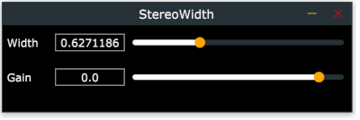

# Stereo Width Demo

A simple implementation of _mid-side processing_. 

Basically, working with stereo data means dealing with two distinct signals, left and right - if they are completely the same, than the sound is "fully mono", the more different thay are, the "more stereo" the sound. 

When doing mid-side processing instead, we apply some math in order to separate the original signal into a "mid" (mono) and "side" (stereo) components (rather than left and right). This allows for example to tweak the relative amplitides in order to make the original source "more stereo" or "more mono", or to selectively apply processing only to the mono/stereo part of a sound. 

After the desired processing is applied, the data is converted back to the familiar left+right format (using the inverse process) so that it can be reproduces by standard players, DAWs etc. 

## Description

There are two simple controls:

* _Width_: controls the _stereo width_ of the signal. When set to hard left, the signal becomes mono. When set to centre the signal is unchanged and, finally, when set to right the signal becomes "fully stereo" i.e. there is no mono component left. 

* _Gain_: just sets the gain of the signal 

## Resources

* [The Basics of Mid-Side Processing](https://theproaudiofiles.com/mid-side-processing/) 
* [What Is Mid/Side Processing?](https://www.izotope.com/en/blog/mastering/what-is-midside-processing.html)
