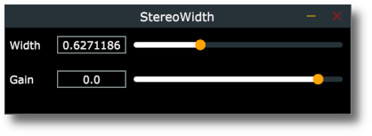

# Stereo Width Demo

A simple implementation of _mid-side processing_. 

Basically, when working with stereo data we usually work with two distinct signals: left and right. 
When doing mid-side processing instead, we apply some math in order to separate the original signal into a "mid" (i.e. mono) and "side" (i.e. stereo) components. This allows for example to tweak the relative amplitides in order to make the original source "more stereo" or "more mono", or for example to apply certain processing (eq, compression etc.) only to the mono part of a sound etc.

After the desired processing is applied, the data is converted back to the familiar left+right format.
For better and more detailed explanations see e.g. [this](https://theproaudiofiles.com/mid-side-processing/) or [this](articles)

## Description

There are two simple controls:

* _Width_: controls the _stereo width_ of the signal. When set to hard left, the signal becomes mono. When set to centre the signal is unchanged and, finally, when set to right the signal becomes "fully stereo" i.e. there is no mono component left. 

* _Gain_: just sets the gain of the signal 
